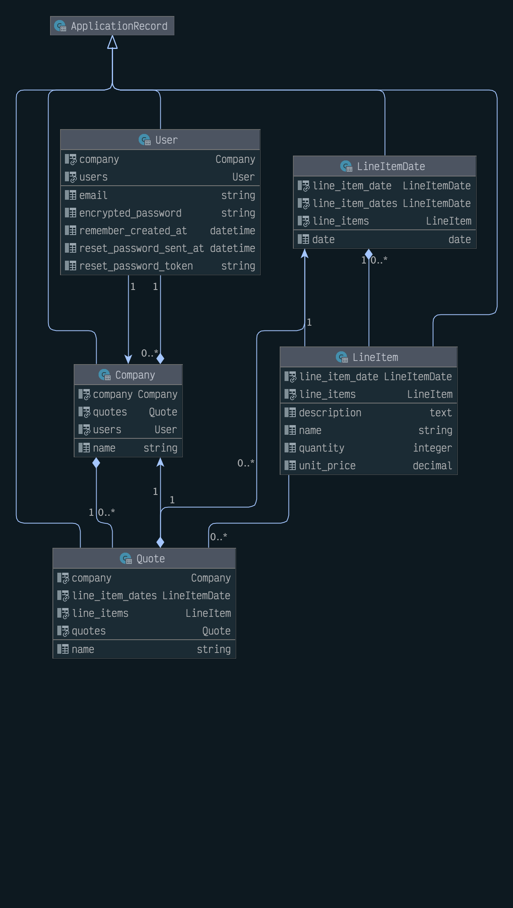

# The Turbo Rails Tutorial

Tutorial link [Hotrails.dev](https://www.hotrails.dev/)

Live Demo of this repo [hotrails-demo-app.herokuapp.com](https://hotrails-demo-app.herokuapp.com/)

### Usage 

 1. Clone this repo and change dir into it.
 2. Run `bin/respan` to setup the dependancies, the database and load seeds.
 3. Run `./bin/dev` to start the app server, JS & CSS watchers
 4. Open your brower at [http://127.0.0.1:3000/](http://127.0.0.1:3000/)
 5. Login using accountant@kpmg.com & `password`
 6. Browse to [Quotes](http://127.0.0.1:3000/quotes)
 7. Play around

### Seeded Data

| Field     |                                        |
|-----------|----------------------------------------|
| Company:  | KPMG                                   |
| Email:    | accountant@kpmg.com / manager@kpmg.com |
| Password: | password                               |
|           |                                        |
| Company:  | PwC                                    |
| Email:    | accountant@pwc.com                     |
| Password: | password                               |

KPMG has two fully seeded quote examples

